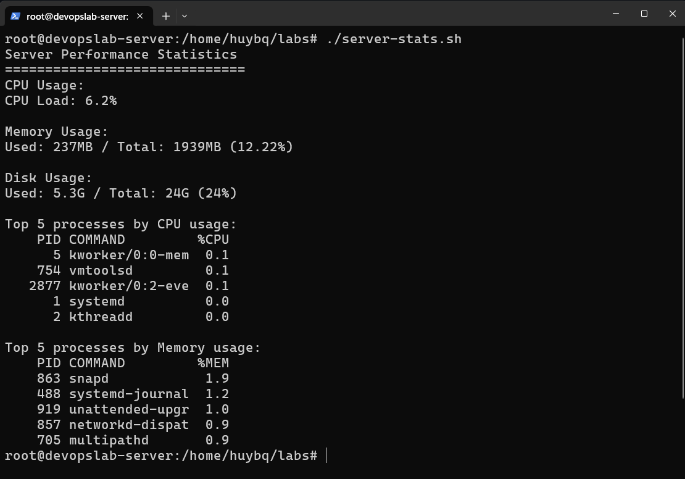

# server-performance-stats 

This project is part of [roadmap.sh](https://roadmap.sh/projects/server-stats) DevOps projects.
---

## Usage

### Step 1: Make the script executable

Before running the script, you need to grant executable permission to `server-stats.sh`:

```bash
chmod +x server-stats.sh
```
### Step 2: Run the script 

Once the script has execution permission, you can run it using the command:

```bash
./server-stats.sh
```

## Sample Output

Here is my output:


